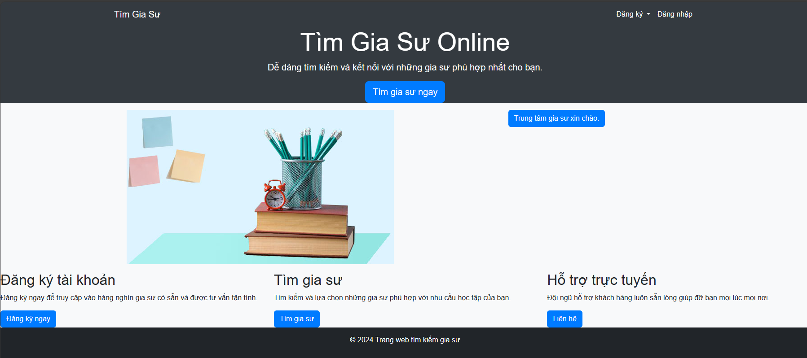

# Dự án Phần mềm Kỹ thuật Web App

## Giới thiệu

Đây là dự án Phần mềm Kỹ thuật Web App được phát triển bởi quyencanh203. Dự án này tập trung vào việc xây dựng một ứng dụng web hiện đại và linh hoạt.


1. [Thông tin dự án](#thông-tin-dự-án)
2. [Yêu cầu](#yêu-cầu)
3. [Cài đặt](#cài-đặt)
4. [Sử dụng](#sử-dụng)
5. [Đóng góp](#đóng-góp)
6. [Giấy phép](#giấy-phép)

## Thông tin dự án

Miêu tả chi tiết về dự án
Dự án lập trình web gia sư.Mục tiêu của web là để tạo ra một nơi để cho học sinh và gia sư có thể tương tác tạo ra các yêu cầu cho tìm kiếm gia sư. Chức năng chính của trang web là để cho học sinh tạo 1 yêu cầu tìm kiếm gia sư và gia sư sẽ vào vào đăng kí nhận lớp.

## Yêu cầu

Liệt kê các yêu cầu cần thiết để cài đặt và chạy dự án.

## Cài đặt

Hướng dẫn cài đặt dự án và thiết lập môi trường phát triển.
- pip install virtualenv 
- virtualenv venv
- venv/Scripts/activate
- pip install -r requirements.txt 
- cd Tutor_app/app 
- python app.py 
```bash

